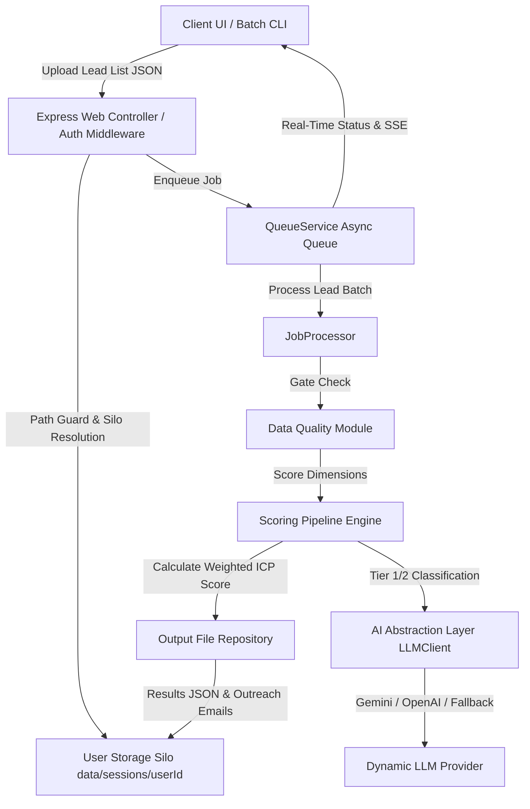

# Technical Specification & Portfolio Showcase — ICP Lead Scoring Engine

> **Commercial-Grade Multi-User Lead Qualification & AI Outreach Generation Engine**  
> Built with TypeScript (Strict), Express, Better Auth (SQLite), Drizzle ORM, Zod, and Gemini/OpenAI AI Strategy Pattern.

---

## 🚀 Portfolio Showcase & Executive Summary

The **Lead Scoring Engine (ICP Profiler)** is an enterprise-ready web platform and CLI tool designed to automate B2B lead qualification. It processes raw candidate/lead lists in batch JSON or CSV format, evaluates profiles against customizable Ideal Customer Profile (ICP) personas across four distinct scoring dimensions, and dynamically generates tailored outbound sales emails using AI.

### 🌟 Key Portfolio Highlights & Architectural Achievements
* **Production Security Posture:** Full multi-user data isolation via filesystem session silos (`data/sessions/{userId}/`) backed by `resolveWithin` path guards to eliminate path traversal risks.
* **Modern Hybrid Authentication:** Integrated **Better Auth** backed by **SQLite WAL mode** supporting both standard email/password authentication and seamless **Google OAuth 2.0** single sign-on via server-forwarded REST API proxies.
* **6-Layer Uni-Directional Pipeline:** Data Quality Gate $\rightarrow$ Education (0.20) $\rightarrow$ Experience (0.35) $\rightarrow$ Thinking Quality (0.40) $\rightarrow$ Composite Scorer (+Recency) $\rightarrow$ Outreach Profiler.
* **Async Non-Blocking Architecture:** High-concurrency background queue processor (`QueueService` + `JobProcessor`) with real-time SSE log streaming and sub-15ms HTTP batch acceptance.
* **Strict Quality Gates:** 27 test suites, 238 unit & integration tests passing cleanly under a strict **per-file 90% statement / 80% branch coverage threshold**. Zero ESLint warnings, strict TypeScript checking (`noImplicitAny`).
* **Hyper-Polished Web UI:** Modern glassmorphic dark-mode aesthetics built with EJS and custom Tailwind utilities. Features single-use Instant Demo Profiling isolated per user ID (`demo_batch_run_{userId}`) and top-right high-contrast completion toasts.

---

## 📐 System Architecture & Data Flow



---

## 🛠️ Technology Stack & Engineering Standards

| Layer | Technology | Purpose / Design Rationale |
| :--- | :--- | :--- |
| **Language** | TypeScript 5.x (Strict Mode) | End-to-end type safety; zero `any` types permitted across codebase. |
| **Web Server** | Node.js + Express | Lightweight, skinny controller architecture mapping HTTP requests to services. |
| **Authentication** | Better Auth + SQLite | Secure identity management, session tokens, and OAuth 2.0 integration. |
| **Database & Storage**| SQLite (`data/icp.db`) + Disk Silos | SQLite in WAL mode for user credentials; partitioned disk silos for user job files. |
| **Validation** | Zod | Single source of truth for schema validation and inferred domain types. |
| **AI Integration** | Strategy Pattern (`LLMClient`) | Pluggable providers (`GeminiProvider`, `OpenAIProvider`, `NullProvider`). |
| **Logging** | Pino | High-performance structured JSON logging with automatic PII/secret redaction. |
| **Testing & CI** | Jest + Playwright | 27 test suites with enforced per-file coverage floors; Playwright E2E journeys. |

---

## 📊 Core Scoring Methodology

The qualification engine calculates a composite ICP Score ($0 - 100$) based on four core modules:

$$\text{ICP Score} = w_{\text{edu}} \cdot S_{\text{edu}} + w_{\text{exp}} \cdot S_{\text{exp}} + w_{\text{think}} \cdot S_{\text{think}} + \text{Recency Bonus}$$

1. **Data Quality Gate:** Evaluates required fields (Name, Current Role, Company). Profiles missing critical data are rejected immediately.
2. **Education (20% Weight):** Evaluates university prestige and degree level. AI provider classifies unknown global universities into Tier 1, Tier 2, or Tier 3.
3. **Experience (35% Weight):** Evaluates total experience years, role seniority match against active Persona, and company tier reputation.
4. **Thinking Quality (40% Weight):** Analyzes summary text and achievements for leadership, innovation, and strategic keywords.
5. **Recency Adjustment:** Applies bonus points for recent career progression within configurable month thresholds.

---

## 🌟 Strategic Portfolio Roadmap: Transforming into a Commercial SaaS

To extend this engine into a multi-tenant enterprise SaaS product, the following high-value architectural expansions can be implemented:

```
┌─────────────────────────────────────────────────────────────────────────┐
│                    ENTERPRISE SAAS EXPANSION ROADMAP                    │
├───────────────────────────┬───────────────────────────┬─────────────────┤
│ 1. Multi-Tenant Billing   │ 2. Scalable Infrastructure│ 3. Integrations │
│ • Stripe Webhooks         │ • PostgreSQL + Prisma ORM │ • HubSpot CRM   │
│ • Usage-Based Tiering     │ • Redis BullMQ Queue      │ • Salesforce    │
│ • Lead Credit Balance     │ • Docker Microservices    │ • Webhooks API  │
└───────────────────────────┴───────────────────────────┴─────────────────┘
```

### 1. Multi-Tenant Billing & Metered Usage (`Phase 1`)
* **Stripe Integration:** Add metered usage tracking for lead scoring credits (`/api/billing/webhook`).
* **Subscription Tiers:** Free Tier (50 leads/mo), Pro Tier (2,500 leads/mo), Enterprise (Unlimited).

### 2. Distributed Microservice Execution (`Phase 2`)
* **Database Migration:** Upgrade local SQLite storage to managed PostgreSQL via Drizzle ORM / Prisma for horizontal database scaling.
* **Distributed Distributed Queues:** Replace in-memory worker queue with **Redis BullMQ** clusters to process millions of lead profiles concurrently across multiple container instances.

### 3. Native CRM & Outbound Integrations (`Phase 3`)
* **HubSpot & Salesforce Connectors:** Direct bidirectional sync to import leads from CRMs and push qualified ICP scores and AI email drafts back into sales workflows.
* **REST Webhook Triggers:** Expose public API keys (`/api/v1/score`) to allow Zapier and Make.com automation workflows.